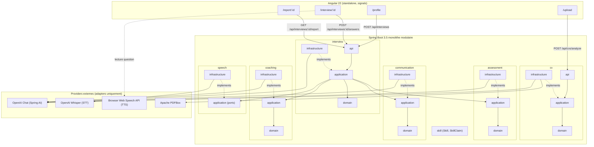

# PLAN.md — ZenikIA POC

Ce document est mis à jour au fur et à mesure de l'avancement. Statuts :
`TODO`, `DOING`, `DONE`, `SKIPPED` (avec raison).

## Architecture retenue

Règle de dépendance : `api → application → domain`,
`infrastructure → application` (implémente les ports), jamais l'inverse.
`domain` ne dépend d'aucun framework.

## Décisions techniques prises (pas de retour en arrière sans raison)

- **Provider IA** : OpenAI via Spring AI (`spring-ai-starter-model-openai`,
  BOM `spring-ai-bom:1.1.8`), Spring Boot `3.5.16`. Structured outputs via
  `ChatClient.entity(...)`.
- **STT** : `OpenAiAudioTranscriptionModel` (Whisper) derrière le port
  `SpeechToTextProvider`. Le navigateur enregistre via `MediaRecorder`
  (webm/opus) et envoie le blob au backend.
- **TTS** : port `TextToSpeechProvider` défini + implémentation
  `OpenAiTextToSpeechProvider` pour préparer l'architecture, mais le POC
  utilise en priorité le fallback navigateur (`speechSynthesis`) pour la
  lecture des questions — plus rapide, gratuit, zéro latence réseau. Voir
  README "Current limitations".
- **Extraction PDF** : Apache PDFBox (`pdfbox`), en mémoire, aucun stockage
  disque du CV au-delà de la requête.
- **Persistence** : repositories en interface dans `application`,
  implémentation `ConcurrentHashMap` dans `infrastructure` pour `cv` et
  `interview`. Remplaçable par une implémentation JPA/PostgreSQL sans
  toucher `application`/`domain`.
- **Contexte LLM** : `InterviewContext` synthétique reconstruit à chaque
  tour (persona, compétence courante, difficulté courante, points validés/
  faibles résumés, dernier échange) — jamais tout l'historique complet.
- **Audio** : non persisté au-delà du traitement de la requête (transcription
  puis suppression immédiate du fichier temporaire).

## Backlog

| Ticket | Titre | Statut |
|---|---|---|
| ZEN-001 | Bootstrap backend (Spring Boot, Maven, structure modulaire, error handling) | DONE |
| ZEN-002 | Bootstrap Angular (standalone, routing, layout, design system minimal) | DONE |
| ZEN-003 | CV upload (endpoint + DTO + validation) | DONE |
| ZEN-004 | Extraction texte PDF (PDFBox) | DONE |
| ZEN-005 | Analyse IA du CV (CvAnalyzer + Spring AI, structured output) | DONE |
| ZEN-006 | Extraction Skill/SkillClaim structurée | DONE |
| ZEN-007 | Sélection de persona | DONE |
| ZEN-008 | Domaine Interview (Session, Question, Answer, states) | DONE |
| ZEN-009 | Génération de question personnalisée (InterviewQuestionGenerator) | DONE |
| ZEN-010 | Technical Assessment Engine (rubric-based) | DONE |
| ZEN-011 | Logique adaptative (InterviewNextAction, difficulté) | DONE |
| ZEN-012 | Enregistrement audio frontend (MediaRecorder) | DONE |
| ZEN-013 | Intégration STT (Whisper via Spring AI) | DONE |
| ZEN-014 | Métriques de communication depuis transcript (WPM, mots, répétitions) | DONE |
| ZEN-015 | Détection des tics de langage (fréquence, pas occurrence unique) | DONE |
| ZEN-016 | Évaluation IA communication (clarté, structure, impact...) | DONE |
| ZEN-017 | Coaching Engine (feedback actionnable) | DONE |
| ZEN-018 | TTS (port + impl OpenAI, fallback navigateur branché en UI) | DONE |
| ZEN-019 | Retry mode (comparaison avant/après) | DONE |
| ZEN-020 | Rapport final (fond / forme / interview effectiveness séparés) | DONE |
| ZEN-021 | Tests unitaires (règles métier, mocks providers IA) | DONE |
| ZEN-022 | UI polish (design produit interne crédible) | DONE |
| ZEN-023 | README + diagramme architecture | DONE |

## État réel au 2026-09-07 (fin de session backend)

Backend Spring Boot entièrement implémenté et vérifié :
- Compile proprement (`./mvnw -q -DskipTests compile`).
- Démarre sans `OPENAI_API_KEY` (placeholder de config, voir README) —
  toutes les routes non-IA fonctionnent, les routes IA renvoient un 502
  `AI_PROVIDER_ERROR` explicite tant qu'une vraie clé n'est pas fournie.
- Testé manuellement de bout en bout jusqu'à la frontière IA : upload d'un
  CV PDF réel → extraction PDFBox → échec attendu et propre à l'appel
  OpenAI (pas de clé valide dans cet environnement).
- 53 tests unitaires verts (`./mvnw -q test`) couvrant : transitions
  `InterviewNextAction`, évolution de la difficulté (jamais de chute
  brutale), détection des tics de langage (fréquence, pas occurrence
  unique), agrégation communication (déterministe + rubric mockée),
  cycle de vie `InterviewSession`/`InterviewTurn` (réponse unique, retry
  nécessite une évaluation préalable), rotation des compétences, calcul
  des scores du rapport final, mapping API/domaine, cas d'erreur HTTP.
- Bug découvert et corrigé pendant les tests : `\b` en Java ne traite pas
  les lettres accentuées comme des caractères de mot par défaut, ce qui
  cassait la détection de "voilà" — corrigé avec
  `Pattern.UNICODE_CHARACTER_CLASS`.

## État réel — frontend + documentation (même session)

Frontend Angular 22 scaffoldé et implémenté en entier :
- Standalone, Signals, TypeScript strict (`strict: true` + `strictTemplates`
  ajoutés explicitement au tsconfig généré).
- 5 pages : `/`, `/upload`, `/profile`, `/interview/:id`, `/report/:id`.
- Services : `ApiService` (un appel par endpoint), `AudioRecorderService`
  (MediaRecorder + durée mesurée côté client), `SpeechSynthesisService`
  (fallback navigateur pour lire les questions), `AppStateService` (pont
  CV analysé → `/profile`, avec résilience sessionStorage au refresh).
- `ng build` propre (aucun warning après ajustement du budget CSS par
  composant) et `ng test` vert (Vitest, le runner par défaut d'Angular 22).
- Vérifié dans le navigateur (via le panneau Preview) : landing page,
  upload page, garde de route `/profile` (redirige vers `/upload` si aucun
  profil en mémoire) — rendu conforme au brief design §39.
- Limite de vérification : l'upload de fichier réel et l'enregistrement
  micro ne sont pas automatisables depuis cet environnement (pas de
  file picker ni de permission micro dans le navigateur headless du
  Preview) — à tester manuellement par l'utilisateur. Le pipeline CV →
  extraction PDFBox → appel IA a été validé côté backend via `curl` avec un
  vrai PDF (voir plus haut) ; le reste de la boucle IA (génération de
  question, évaluation technique/communication, feedback, rapport) est
  écrit et compile mais n'a pas pu être exécuté avec un vrai
  `OPENAI_API_KEY` dans cet environnement.

README.md et CLAUDE.md finalisés (diagrammes Mermaid, variables d'env,
API, limitations, roadmap).

**Reste à faire par l'utilisateur** : tester le parcours complet avec un
vrai `OPENAI_API_KEY` (génération de question, boucle adaptative,
feedback, rapport) et l'enregistrement micro réel dans un vrai navigateur.

## Notes de session

- Repository initial : dossier `zenika/` contenait déjà plusieurs projets
  sans rapport (kafka-demo, bankflow, trip-service-kata...). ZenikIA est
  créé dans un sous-dossier dédié `zenika/zenikia/` avec son propre `git
  init`, pour ne pas polluer ni dépendre de l'existant.
- Aucune clé `OPENAI_API_KEY` n'était présente dans l'environnement au
  moment du build. Le backend démarre sans clé (les endpoints IA renverront
  une erreur explicite tant que la clé n'est pas configurée) — voir
  README "Environment variables".

## ZEN-024 Provider IA gratuit (Ollama) + STT navigateur gratuit

L'utilisateur a testé avec une vraie clé OpenAI et n'avait plus de crédit
(abonnement ChatGPT Plus ≠ crédit API — deux facturations séparées) ; il a
demandé un chemin sans dépense, avec Ollama déjà installé en local
(`qwen3:4b` déjà pull-é).

Ajouté sans changer l'architecture existante (c'est exactement ce que les
ports/adapters permettent) :
- `spring-ai-starter-model-ollama` ajouté au pom, propriété Spring AI
  `spring.ai.model.chat` (`ZENIKIA_CHAT_PROVIDER`) pour basculer
  openai/ollama sans conflit de bean `ChatModel` — zéro changement dans
  `application`/`domain`, un seul `ChatClient` partagé toujours utilisé.
- `num-ctx: 8192` ajouté à la config Ollama (le défaut 4096 tokens est trop
  court une fois prompt système + schéma JSON + texte de CV + "thinking"
  du modèle combinés).
- `InterviewOrchestrationService.submitAnswer/retryAnswer` acceptent
  maintenant un `clientProvidedTranscript` optionnel : si le frontend a
  déjà transcrit (reconnaissance vocale navigateur, gratuite), l'appel
  `SpeechToTextProvider` (Whisper, payant) est sauté entièrement.
  `resolveTranscript()` centralise ce choix.
- Frontend : nouveau `SpeechRecognitionService` (Web Speech API,
  Chrome/Edge), branché dans `InterviewPage` en parallèle de
  `AudioRecorderService` ; transcript envoyé via `ApiService`.
- **Bug réel découvert et corrigé** : un modèle local (qwen3:4b) ne respecte
  pas aussi strictement un schéma JSON imbriqué qu'OpenAI structured
  outputs — `skills`/`claims`/`experiences` revenaient parfois en simples
  chaînes au lieu d'objets, cassant la désérialisation Jackson
  (`MismatchedInputException`). Corrigé avec des désérialiseurs Jackson
  tolérants (`LenientJson`, `@JsonDeserialize` custom sur les records
  `SkillAi`/`ClaimAi`/`ExperienceAi`) — testé (`CvAnalysisAiResponseTest`).
- Documenté dans README ("Run for free with Ollama") et CLAUDE.md.
- **Statut du test end-to-end réel avec Ollama** : validé pour l'analyse de
  CV avec `qwen3:4b` (extraction correcte, quelques minutes par appel sur
  M4 Pro — GPU à 100%, la lenteur vient du mode "thinking" du modèle, pas
  du matériel).
- **Tentative ratée de désactiver "thinking" pour aller plus vite** : a
  cassé la génération de question (le raisonnement du modèle se retrouvait
  mélangé au JSON final au lieu d'être isolé par Ollama) → **revert
  complet**, `disableThinking()` supprimé. Leçon : pour un modèle
  "thinking", plus lent-mais-correct vaut mieux que plus rapide-mais-cassé.
  Piste retenue à la place : utiliser un modèle plus petit et non-thinking
  (ex. `llama3.2:3b`) si la vitesse prime sur la qualité d'extraction.
- **Bug réel n°2 découvert en conditions réelles (vrai CV, vraie réponse
  orale)** : `JsonEOFException` sur la génération de question suivante — le
  modèle local tronquait son JSON en cours de génération. Cause : fenêtre
  de contexte (8192) trop juste une fois persona + résumé candidat +
  concepts + claims + **transcript complet de la réponse précédente**
  combinés, ne laissant plus assez de place pour la réponse. Corrigé par
  (a) `num-ctx` par défaut porté à 16384, et (b) troncature défensive du
  transcript de la réponse précédente injecté dans `InterviewContext`
  (`InterviewOrchestrationService.LAST_ANSWER_CONTEXT_CHAR_LIMIT`, 1500
  caractères — c'est un rappel de continuité, pas une donnée notée, une
  troncature n'en dégrade pas la valeur).
- **Bug réel n°3** : la troncature JSON revenait quand même parfois, y
  compris sur la toute première question (contexte pourtant minimal) — un
  modèle local de 3-4B paramètres peut simplement mal suivre le format
  demandé de façon non déterministe, pas seulement par manque de place.
  Ajouté `shared/infrastructure/AiCallRetry` : un seul retry automatique
  sur tout appel structuré qui échoue (erreur réseau ou réponse
  invalide/vide), câblé dans les 6 adapters Spring AI. Testé
  (`AiCallRetryTest`).
- **Retours qualité du testeur (attendus, pas des bugs)** avec le chemin
  gratuit (navigateur + petit modèle local) :
  - la reconnaissance vocale du navigateur déforme parfois le jargon
    technique mal articulé (ex. "event driven" → "levain driven") — limite
    connue de l'API Web Speech, pas de notre code ; Whisper (payant) ferait
    mieux.
  - un modèle 3-4B est moins robuste qu'GPT-4o-mini face à une réponse
    orale imparfaite/mal transcrite.
  - le coaching ne donne jamais "la bonne réponse" à la question technique
    — **c'est voulu** (ZenikIA challenge, ne corrige pas comme un cours),
    mais ça pourrait devenir une fonctionnalité optionnelle si demandée
    (hors scope actuel, à discuter avant de l'ajouter).

## ZEN-026 Correction de jargon (STT navigateur) + réponse modèle

Suite directe des retours ci-dessus, deux demandes explicites de
l'utilisateur :

1. **Réponse modèle** : `CoachingFeedback.modelAnswer` (nouveau champ),
   généré dans le même appel LLM que le reste du coaching (pas d'appel
   supplémentaire). Prompt (`coaching-feedback-system.st`) : concise,
   générique, jamais d'expérience personnelle inventée. UI : masquée par
   défaut, bouton "👁️ Voir une réponse modèle" pour la révéler à la
   demande — cohérent avec "ZenikIA challenge, ne corrige pas".
2. **Correction du jargon technique déformé par la reconnaissance vocale
   du navigateur** : nouveau port `speech.application.TranscriptCorrector`
   + adapter `SpringAiTranscriptCorrector` (texte brut via `.content()`,
   pas de structured output — pas besoin ici, et ça évite la fragilité
   JSON d'un petit modèle). Règles strictes dans le prompt : corriger
   UNIQUEMENT les erreurs phonétiques évidentes sur du vocabulaire
   technique, ne jamais reformuler/améliorer/compléter (sinon l'évaluation
   ne porterait plus sur ce que le candidat a réellement dit). Filet de
   sécurité côté code : si le résultat est vide ou anormalement plus long
   que l'original, on garde la transcription d'origine. N'est appelé QUE
   pour un transcript fourni par le navigateur (`resolveTranscript`) — pas
   pour Whisper, déjà meilleur sur ce point et déjà payant.
3. Effet de bord assumé : un appel LLM de plus par réponse sur le chemin
   gratuit → latence supplémentaire, documenté dans le README.

## ZEN-027 Fiabilité structurée : StructuredAiCall + JsonRepair

Le retry simple (ZEN-025) ne suffisait pas : le JSON tronqué revenait de
façon quasi systématique sur la génération de question avec
`llama3.2:3b`, deux tentatives identiques échouant l'une après l'autre.
Cause confirmée : le modèle arrête parfois la génération juste après avoir
fermé la dernière valeur string, sans jamais écrire l'accolade fermante —
un problème d'arrêt de génération (probablement lié au sampling / à la
manière dont le modèle a été fine-tuné), pas un manque de place dans le
contexte (le num_ctx augmenté en ZEN-025 n'a pas suffi seul).

Remplacé `ChatClient...entity(Class)` par un nouvel appel commun,
`shared/infrastructure/StructuredAiCall`, utilisé par les 6 adapters IA
structurés (CV, question, technique, communication, coaching, rapport) :
appelle le modèle en texte brut (`.content()`), utilise directement
`BeanOutputConverter` de Spring AI pour les instructions de format ET le
parsing (donc toujours du structured output, pas de parsing maison), mais
avant d'abandonner sur un échec de parsing, tente une réparation
mécanique du JSON tronqué (`JsonRepair.closeTruncatedJson` — équilibrage
d'accolades/crochets avec une pile, fermeture d'une chaîne restée ouverte)
et reparse. Le tout reste enveloppé par `AiCallRetry` (un appel LLM complet
supplémentaire si la réparation locale ne suffit pas non plus).

**Validé en conditions réelles** (pas seulement en tests unitaires) :
backend de test isolé (port 8081, ne touche pas à l'instance de
l'utilisateur), avec exactement sa config (`ZENIKIA_CHAT_PROVIDER=ollama`,
`ZENIKIA_OLLAMA_MODEL=llama3.2:3b`) : CV réel → session → 2 réponses
soumises (audio factice + transcript fourni directement pour isoler le
problème de la qualité de la reconnaissance vocale) → les deux ont produit
évaluation technique + communication + coaching (avec `modelAnswer`) +
question suivante, sans une seule erreur de troncature JSON. 65 tests
unitaires verts (`JsonRepairTest`, `AiCallRetryTest` inclus).

## ZEN-028 Diversité des sujets + question d'ouverture Recruiter fiable

Deux retours utilisateur après un vrai parcours multi-questions :

1. **La question d'ouverture Recruiter dérivait vers Kafka** au lieu de
   "Présente-toi en cinq minutes." littéralement : le prompt portait à la
   fois la consigne d'ouverture ET une compétence ciblée + des claims CV,
   ce qu'un petit modèle local mélange. Fix : plus d'appel LLM du tout pour
   ce cas précis — `InterviewOrchestrationService.generateQuestion`
   construit directement la question canonique quand
   `opening && persona == RECRUITER`. Plus fiable et plus rapide (un appel
   IA de moins).
2. **Le sujet ne changeait jamais si les réponses restaient moyennes** :
   bug réel dans `InterviewProgressionPolicy.determineNextAction` — le
   test `turnsOnCurrentSkill >= MAX_TURNS_PER_SKILL` n'était évalué
   qu'après avoir écarté CLARIFY/DEEPEN, donc un candidat qui reste sous le
   seuil DEEPEN ne déclenchait jamais CHANGE_TOPIC et pouvait rester sur le
   même skill (ex. Kafka) toute la session. Fix : ce test passe maintenant
   en premier, avant toute branche liée au score — la rotation de sujet
   est désormais garantie après N tours, indépendamment du niveau du
   candidat. `MAX_TURNS_PER_SKILL` réduit de 3 à 2 pour couvrir davantage
   de compétences du CV dans les 8 tours max d'une session.

Tests ajoutés : `determineNextAction_switchesTopicWhenSkillExhaustedEvenOnWeakAnswer`.
66 tests unitaires verts.

**Limite connue à cette date, résolue par ZEN-029 ci-dessous** : après la
question d'ouverture, RECRUITER suivait la même rotation de compétences
techniques que les autres personas au lieu de rester sur parcours/
motivation/storytelling.

## ZEN-029 Banque de questions de référence (few-shot grounding, PAS un RAG)

Retour utilisateur : les questions générées "ne sont pas logiques", "ne
suivent pas un entretien classique" — un petit modèle local livré à
lui-même improvise des questions parfois maladroites. L'utilisateur a
fourni un document réel de banque de questions d'entretien Zenika
(Java, Spring, Hibernate/JPA, JS/TS, React/Angular, Node, HTML/CSS, Git,
HTTP/REST, bases de données, MongoDB, Kafka, Kubernetes, architecture,
sécurité, agilité, craft, posture/comportemental).

Implémenté :
- `backend/src/main/resources/question-bank.yml` — banque curée (pas
  copiée intégralement : questions ouvertes adaptées à un entretien oral,
  les QCM du document source ont été reformulés ou écartés), organisée par
  clé normalisée (java, spring, angular, kafka, architecture, posture...).
- `interview/infrastructure/QuestionBank.java` — chargement SnakeYAML
  (déjà présent en transitif, aucune dépendance ajoutée), matching souple
  compétence CV → clé de banque (`"Spring Boot".contains("spring")`),
  repli sur "craft" si rien ne correspond, échantillonnage aléatoire pour
  varier les exemples fournis d'un tour à l'autre. Testé
  (`QuestionBankTest`).
- `question-generation-system.st` : nouveau placeholder
  `{referenceQuestions}` avec consigne explicite — s'en inspirer pour
  rester logique et crédible, **ne jamais recopier mot pour mot sans
  adapter** au candidat/persona/historique (ça reste adaptatif, pas une
  liste statique servie telle quelle, cf. spec §8).
- **RECRUITER (hors ouverture) bascule sur la banque "posture"** au lieu de
  la rotation de compétences techniques — corrige au passage la dérive
  "l'entretien recruteur ne parle que de Kafka" en restant sur parcours/
  motivation/storytelling, conformément au persona.

**Décision produit explicite** : l'utilisateur a proposé de transformer ça
en RAG (embeddings + recherche vectorielle). Rappelé que RAG/pgvector sont
explicitement exclus du scope POC (specs §5, §35, §41 — "à préparer, pas
implémenter"). Question posée à l'utilisateur, réponse : **garder la
banque simple**, pas de RAG. Un matching par mot-clé sur ~100 questions/
~20 catégories bien nommées couvre déjà le besoin réel (vérifié en
conditions réelles, voir ci-dessous) ; un RAG résoudrait un problème de
passage à l'échelle qu'on n'a pas à ce stade.

**Validé en conditions réelles** (port 8081, `llama3.2:3b`, vrai CV) :
première question DEVELOPER générée sur la compétence extraite en premier
(Angular cette fois) — reprise quasi verbatim d'une question de la banque
("Comment utilises-tu les Signals ou RxJS pour gérer un état asynchrone
dans un composant ?"), logique et crédible. Rotation de sujet confirmée
opérationnelle (reste sur Angular tant que < `MAX_TURNS_PER_SKILL`).
70 tests unitaires verts.

## ZEN-030 Design System Zenika (industrialisation du front)

Demande explicite de l'utilisateur : mettre en place un vrai Design
System inspiré de l'identité Zenika (zenika.com), pas juste refaire le
CSS — architecture réutilisable, skill Claude dédiée, CLAUDE.md mis à
jour, pour que toute évolution frontend future applique automatiquement
la charte.

**Méthode suivie** (dans l'ordre demandé) : audit Zenika → audit frontend
existant → proposition (structure, tokens, SKILL.md, CLAUDE.md) →
implémentation, sans sauter d'étape.

**Audit zenika.com** : valeurs réelles extraites via DevTools
(`getComputedStyle`, pas d'approximation) — site en React + Material-UI.
Fond `#121212`, cards `rgba(30,30,30,.5)` + bordure `rgba(255,255,255,.1)`,
gradient CTA `#EE2238 → #BF1D67`, Nunito (titres) + Open Sans (corps),
radius 16px (cards) / 25-50px (boutons), ombre carte
`0 4px 4px rgba(0,0,0,.25)`, nav 72px, breakpoints MUI standards
(600/900/1200/1536). Aucun formulaire public observable → documenté comme
extrapolation assumée, pas présenté comme une valeur "officielle".

**Audit frontend existant** : couleurs déjà bien centralisées (67 usages
`var(--zk-*)`, 2 hex résiduels), mais spacing/radius/shadow 100%
codés en dur sans échelle partagée, et plusieurs variantes de "card"
quasi identiques dupliquées par écran (`.zk-persona-card`,
`.zk-score-card`, `.zk-assess-card`...).

**Traduction marque → produit** (pas une copie de zenika.com) : densité
plus élevée, gradient de marque réservé à 1-2 actions signature par écran
(jamais un fond), contraste renforcé pour WCAG AA sur un produit utilisé
longtemps (vs un site marketing qu'on scrolle quelques secondes).

**Livré** :
- `design-system/` — tokens CSS (`--znk-*` : colors avec thème clair/sombre,
  typography, spacing base 4px, radius, shadows, z-index, breakpoints),
  4 foundations, 7 docs de composants, 3 patterns, `DESIGN_SYSTEM.md`
  central (source de vérité), `README.md`.
- `.claude/skills/zenika-design-system/SKILL.md` — workflow en 10 points,
  se déclenche sur toute tâche UI/UX/frontend/composant/page/formulaire/
  styling/responsive/accessibilité.
- `CLAUDE.md` — section "Frontend & Design System" ajoutée.
- 6 composants Angular réels (`frontend/src/app/shared/ui/`) — Button,
  Card, Badge, Alert, ProgressMeter, Skeleton — uniquement ceux dont le
  POC a un usage réel aujourd'hui (Input/Select/Modal/Tabs/Toast
  documentés mais volontairement non codés : `DESIGN_SYSTEM.md` liste
  explicitement ce qui est "⏳ documenté, non implémenté" et pourquoi).
- **Migration réelle des 5 écrans** (landing, upload, profile, interview,
  report) : tous les boutons/cards/badges/alertes/meters remplacés par les
  composants partagés ; tous les radius/shadows/spacing/couleurs hex en
  dur retokenisés (vérifié par grep : 0 hex, 0 box-shadow brut, 1
  border-radius brut restant corrigé après coup). États de chargement
  texte remplacés par `<zk-skeleton>` sur `/profile` et `/report`
  (pattern `loading-states.md`). Aucune logique métier touchée.
- Import cross-package `design-system/tokens/index.css` depuis
  `frontend/src/styles.css` (chemin relatif hors du dossier `frontend/`)
  — validé fonctionnel avec le bundler esbuild d'Angular 22.

**Vérifié** :
- `ng build` et `ng test` propres après chaque étape de migration.
- Landing et Upload vérifiés visuellement en conditions réelles (Browser
  pane) en thème clair ET sombre — rendu conforme à l'objectif ("si
  Zenika avait conçu ce produit").
- Garde de route `/profile` (redirection vers `/upload` sans profil en
  mémoire) reconfirmée fonctionnelle après migration.

**Non vérifié visuellement dans cette session** (limite assumée, à
signaler) : `/profile`, `/interview/:id` et `/report/:id` avec de
vraies données — nécessiterait soit un upload de fichier réel (non
pilotable par les outils de navigateur disponibles dans cette session),
soit de solliciter le backend de l'utilisateur sans y être invité. Le
code compile, réutilise les mêmes composants déjà vérifiés visuellement
sur landing/upload, mais un vrai passage utilisateur sur ces 3 écrans
reste recommandé avant de considérer la migration entièrement bouclée.

## Décision : pas de "Coding Arena" (exercices de code en direct)

Demandé par l'utilisateur (éditeur de code type CodinGame, timer, exécution
des tests). Rappelé que "Coding Arena" est explicitement listée en
WON'T HAVE dans le brief initial (§35, §41), et que la vraie difficulté
n'est pas l'éditeur mais l'exécution sûre de code arbitraire (sandbox
conteneurisée pour Java, ou exécution 100% navigateur si JS/TS
uniquement — deux options aux implications très différentes en scope/
sécurité, présentées avant tout code). **Décision de l'utilisateur : ne
pas l'implémenter maintenant**, rester dans le scope initial du POC.
Aucun changement de code. À reconsidérer explicitement si le besoin
revient, avec le même arbitrage scope/sécurité posé sur la table avant
d'écrire quoi que ce soit.
