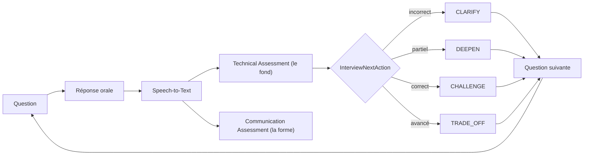

# ZenikIA

**AI Interview, Skill & Communication Coach** pour consultants qui préparent
des entretiens clients.

> Challenge ce que tu sais. Améliore la manière dont tu le défends.

## Vision

ZenikIA challenge deux dimensions d'un entretien, **toujours séparément,
jamais fusionnées en un seul score** :

1. **Le fond** — exactitude technique, profondeur, raisonnement, exemples
   concrets, expérience réelle, compréhension des trade-offs, maîtrise
   production.
2. **La forme** — clarté, structure, concision, débit, hésitations,
   répétitions, tics de langage, adaptation à l'interlocuteur, impact.

Un consultant peut être excellent techniquement et mauvais à l'oral, ou
l'inverse — ZenikIA doit le montrer clairement, jamais le masquer derrière
une moyenne. Le produit adapte aussi ses questions à la réponse précédente
(follow-up réellement adaptatif, pas une liste statique) et challenge les
affirmations vagues du CV ("scalable", "résilient", "architecture
microservices"...) selon le persona choisi.

## Architecture

Monolithe modulaire (pas de microservices, pas de Kafka, pas de
Kubernetes). Chaque module suit la même séparation :

```
<module>
├── api             — controllers, DTO REST (fins, zéro logique métier)
├── application     — services applicatifs, ports (interfaces)
├── domain          — entités, value objects, règles métier pures
└── infrastructure  — implémentations des ports (Spring AI, PDFBox, mémoire)
```

`domain` ne dépend d'aucun framework. `infrastructure` implémente les ports
définis dans `application` — changer de provider IA/STT/TTS ne touche ni le
domaine ni les services applicatifs.

```mermaid
flowchart TD
    subgraph FE["Angular 22 (standalone, signals)"]
        Upload["/upload"]
        Profile["/profile"]
        Interview["/interview/:id"]
        Report["/report/:id"]
    end

    subgraph BE["Spring Boot 3.5 — monolithe modulaire"]
        CV["cv"]
        SKILL["skill"]
        IV["interview"]
        AS["assessment"]
        CO["communication"]
        CC["coaching"]
        SP["speech"]
    end

    subgraph EXT["Providers externes (adapters uniquement)"]
        OpenAI["OpenAI Chat (payant)"]
        Ollama["Ollama local (gratuit)"]
        Whisper["OpenAI Whisper (STT, payant)"]
        BrowserSTT["Web Speech API (STT, gratuit)"]
        BrowserTTS["speechSynthesis (TTS, gratuit)"]
        PDFBox["Apache PDFBox"]
    end

    Upload -->|POST /api/cvs/analyze| CV
    Profile -->|POST /api/interviews| IV
    Interview -->|POST /api/interviews/:id/answers + transcript?| IV
    Interview -->|POST /api/interviews/:id/retry| IV
    Interview -. lecture question .-> BrowserTTS
    Interview -. transcription live .-> BrowserSTT
    Report -->|GET /api/interviews/:id/report| IV

    IV --> AS
    IV --> CO
    IV --> CC
    IV --> SP
    CV --> SKILL
    IV --> SKILL

    CV --> PDFBox
    CV -.spring.ai.model.chat.-> OpenAI
    CV -.spring.ai.model.chat.-> Ollama
    IV --> OpenAI
    IV --> Ollama
    AS --> OpenAI
    AS --> Ollama
    CO --> OpenAI
    CO --> Ollama
    CC --> OpenAI
    CC --> Ollama
    SP -->|si pas de transcript navigateur| Whisper
```

La boucle d'entretien adaptative (spec produit) :



La décision `InterviewNextAction` est prise par une règle métier pure et
testée (`InterviewProgressionPolicy`), pas par un LLM livré à lui-même : le
LLM évalue, l'application décide.

## Stack

- **Backend** : Java 21, Spring Boot 3.5, Spring AI 1.1 (OpenAI), Maven,
  Bean Validation, JUnit 5, Mockito, Apache PDFBox.
- **Frontend** : Angular 22 (composants standalone, Signals), TypeScript
  strict, responsive.
- **Persistence** : en mémoire pour le POC (`ConcurrentHashMap`), derrière
  des interfaces de repository — prêt pour un remplacement PostgreSQL sans
  toucher `application`/`domain`.

## How to run

Prérequis : Java 21, Node 20+, une clé `OPENAI_API_KEY` valide pour les
fonctionnalités IA (le backend démarre sans, voir "Current limitations").

```bash
# Terminal 1 — backend (port 8080)
cd backend
export OPENAI_API_KEY=sk-...
./mvnw spring-boot:run
```

```bash
# Terminal 2 — frontend (port 4200)
cd frontend
npm install
npm start
```

Ouvrir <http://localhost:4200>. L'URL de l'API backend est actuellement
codée en dur sur `http://localhost:4200` → `http://localhost:8080/api`
(`frontend/src/app/core/api-config.ts`) — POC mono-hôte, pas de config
d'environnement multi-cible pour l'instant.

## Run for free (sans dépenser un centime)

Un abonnement ChatGPT Plus **n'inclut aucun crédit API** — c'est une
facturation séparée sur platform.openai.com. Pour faire tourner ZenikIA
sans payer :

1. **Chat (analyse CV, questions, évaluations, coaching, rapport) → Ollama
   en local.**
   ```bash
   ollama pull qwen3:4b      # ou un autre modèle de chat déjà installé
   ollama serve              # si pas déjà lancé en arrière-plan
   export ZENIKIA_CHAT_PROVIDER=ollama
   export ZENIKIA_OLLAMA_MODEL=qwen3:4b   # doit matcher un modèle déjà pull
   cd backend && ./mvnw spring-boot:run
   ```
   `spring.ai.model.chat` (propriété Spring AI) bascule entre les
   auto-configurations OpenAI/Ollama sans conflit de bean — aucun code
   applicatif ne change, seul l'adapter change (voir `ChatClientConfig`).

2. **Speech-to-Text → reconnaissance vocale du navigateur (Chrome/Edge),
   gratuite, aucune clé requise.** Le frontend transcrit déjà la réponse en
   direct pendant l'enregistrement (`SpeechRecognitionService`) et l'envoie
   au backend ; celui-ci saute alors l'appel à `SpeechToTextProvider`
   (Whisper) et utilise directement ce texte (voir
   `InterviewOrchestrationService.resolveTranscript`). Sur un navigateur qui
   ne supporte pas l'API (Firefox, Safari), le backend retente Whisper — qui
   a alors besoin d'un `OPENAI_API_KEY` avec du crédit.
   La reconnaissance du navigateur déforme parfois le jargon technique mal
   articulé (ex. "event-driven" entendu "levain driven") : une passe de
   correction IA dédiée (`TranscriptCorrector` / `SpringAiTranscriptCorrector`)
   tourne uniquement sur ce chemin, avec pour consigne stricte de ne
   corriger QUE les erreurs phonétiques évidentes sur du vocabulaire
   technique — jamais reformuler, améliorer ou compléter la réponse (sinon
   l'évaluation ne porterait plus sur ce que le candidat a réellement dit).
   En cas de doute ou d'échec, elle renvoie la transcription originale
   inchangée plutôt que de risquer de la corrompre.
3. **Text-to-Speech → déjà gratuit par défaut** (synthèse vocale du
   navigateur, voir plus bas), aucune action nécessaire.

Avec ces trois réglages, aucun appel de l'application ne touche une API
payante. Contrepartie attendue : un modèle local de quelques milliards de
paramètres (ex. `qwen3:4b`) est nettement moins fiable qu'OpenAI pour
respecter un schéma JSON imbriqué — le mapping CV (`CvAnalysisAiResponse`)
tolère par exemple qu'un élément de liste revienne en simple chaîne au lieu
d'un objet complet (voir `LenientJson`), et la qualité des questions/
évaluations sera globalement plus faible qu'avec GPT-4o-mini. C'est un
compromis qualité/coût assumé pour un POC gratuit, pas un défaut à corriger.

## Environment variables

| Variable | Obligatoire | Défaut | Description |
|---|---|---|---|
| `OPENAI_API_KEY` | Si `ZENIKIA_CHAT_PROVIDER=openai` (défaut) ou pour STT/TTS OpenAI | — | Clé API OpenAI. Jamais commitée, jamais loggée. |
| `ZENIKIA_CHAT_PROVIDER` | non | `openai` | `openai` ou `ollama` — voir "Run for free" ci-dessus. |
| `ZENIKIA_OPENAI_CHAT_MODEL` | non | `gpt-4o-mini` | Modèle de chat OpenAI (si provider = openai). |
| `ZENIKIA_OLLAMA_BASE_URL` | non | `http://localhost:11434` | URL du serveur Ollama local. |
| `ZENIKIA_OLLAMA_MODEL` | non | `qwen3:4b` | Modèle de chat Ollama (doit déjà être `ollama pull`-é). |
| `ZENIKIA_OPENAI_TRANSCRIPTION_MODEL` | non | `whisper-1` | Modèle de transcription audio (fallback si le navigateur ne transcrit pas). |
| `ZENIKIA_OPENAI_TTS_MODEL` / `_VOICE` | non | `tts-1` / `alloy` | Modèle/voix TTS serveur (non branché par défaut à l'UI, voir plus bas). |
| `ZENIKIA_ALLOWED_ORIGIN` | non | `http://localhost:4200` | Origine autorisée en CORS. |
| `PORT` | non | `8080` | Port du backend. |

Sans `OPENAI_API_KEY`, le backend démarre quand même (un placeholder est
utilisé pour satisfaire Spring AI au boot) : toutes les routes non-IA
fonctionnent, les routes IA renvoient un `502 AI_PROVIDER_ERROR` explicite.

## Backend

Modules : `cv`, `skill`, `interview`, `assessment`, `communication`,
`coaching`, `speech`, `shared`. Voir [CLAUDE.md](CLAUDE.md) pour les
conventions détaillées et les ports à respecter
(`CvAnalyzer`, `InterviewQuestionGenerator`, `TechnicalAnswerEvaluator`,
`CommunicationEvaluator`, `SpeechToTextProvider`, `TextToSpeechProvider`,
`CoachingFeedbackGenerator`, `FinalReportGenerator`).

Prompts dans `backend/src/main/resources/prompts/*.st` — un fichier par
usage (`cv-analysis-system`, `question-generation-system`,
`technical-assessment-system`, `communication-assessment-system`,
`coaching-feedback-system`, `final-report-system`,
`transcript-correction-system`), jamais un prompt géant unique. Chaque
prompt rappelle explicitement que le contenu candidat (CV, transcription)
est une donnée à analyser, jamais des instructions.

`backend/src/main/resources/question-bank.yml` — banque de questions
d'entretien réelles curées, organisée par compétence (`interview.
infrastructure.QuestionBank`). Injectée comme exemples de référence dans
le prompt de génération de question (few-shot grounding) pour que le LLM
reste logique et crédible plutôt que d'improviser — jamais servie telle
quelle comme liste statique (la question reste adaptative, personnalisée
au candidat/persona/historique). Volontairement une simple correspondance
par mot-clé, pas un RAG (embeddings + recherche vectorielle) : hors scope
POC (voir "Roadmap"), et inutile à l'échelle d'une centaine de questions.

```bash
cd backend
./mvnw test                     # 53 tests unitaires (règles métier, mocks des providers IA)
./mvnw -q -DskipTests package
```

## Frontend

Pages : `/`, `/upload`, `/profile`, `/interview/:id`, `/report/:id`.
États explicites de l'écran d'entretien : `READY`, `AI_SPEAKING`,
`LISTENING`, `TRANSCRIBING`, `ANALYZING`, `FEEDBACK`, `FINISHED`.

Services clés (`frontend/src/app/core/services`) :
- `ApiService` — un appel HTTP par endpoint, aucune logique.
- `AudioRecorderService` — `MediaRecorder` + `getUserMedia`, mesure la
  durée réelle d'enregistrement côté client.
- `SpeechSynthesisService` — lecture des questions via `speechSynthesis`
  du navigateur (fallback, voir limitations).
- `SpeechRecognitionService` — transcription live gratuite via l'API Web
  Speech du navigateur (Chrome/Edge), envoyée au backend pour éviter
  l'appel Whisper payant — voir "Run for free" plus haut.
- `AppStateService` — pont léger CV analysé → page `/profile` (la route
  `/profile` ne porte pas d'id, cf. spec produit).

```bash
cd frontend
npm test                        # Vitest
npm run build
```

## API

| Méthode | Route | Description |
|---|---|---|
| `POST` | `/api/cvs/analyze` | Upload PDF (multipart `file`) → profil candidat extrait |
| `GET` | `/api/cvs/{id}` | Relit un profil déjà analysé |
| `POST` | `/api/interviews` | `{candidateProfileId, persona}` → session + première question |
| `GET` | `/api/interviews/{id}` | État de la session (question courante, difficulté...) |
| `POST` | `/api/interviews/{id}/answers` | Multipart `turnId`, `audio`, `durationSeconds`, `transcript` (optionnel — si fourni, saute la transcription serveur) → évaluations + feedback + question suivante |
| `POST` | `/api/interviews/{id}/retry` | Même contrat, réessaie la question `turnId` → comparaison avant/après |
| `POST` | `/api/interviews/{id}/finish` | Termine la session manuellement |
| `GET` | `/api/interviews/{id}/report` | Rapport final (fond / forme / effectiveness séparés) |
| `POST` | `/api/speech/tts` | `{text}` → audio MP3 (OpenAI TTS, non branché à l'UI par défaut) |
| `GET` | `/api/health` | Liveness |

Toutes les erreurs renvoient un `ApiError` uniforme
(`{timestamp, status, error, message, details}`) via un
`@RestControllerAdvice` central.

## AI providers

OpenAI ou Ollama (local, gratuit) via Spring AI — un seul `ChatClient`
partagé (`shared/infrastructure/ChatClientConfig`), le choix du provider se
fait par la propriété `spring.ai.model.chat` (`ZENIKIA_CHAT_PROVIDER`),
sans toucher aux adapters. Structured outputs (`ChatClient.entity(...)`) —
jamais de parsing manuel de texte généré. Chaque évaluation (technique,
communication) s'appuie sur une rubrique 0-5 explicite fournie dans le
prompt, jamais une simple demande de "note sur 10". STT reste sur OpenAI
Whisper (Ollama n'a pas de modèle audio) sauf si le navigateur a déjà
transcrit la réponse lui-même (voir "Run for free").

## Current limitations

- **Persistence en mémoire** : tout est perdu au redémarrage du backend.
  Architecture prête pour PostgreSQL (repositories derrière des
  interfaces) mais non implémentée dans ce POC.
- **`longPauseCount` toujours à 0** : détecter des silences fiables
  demanderait des timestamps par segment que cette intégration STT ne
  capture pas. Champ conservé pour l'architecture future, jamais simulé.
- **TTS serveur non branché à l'UI par défaut** : le port
  `TextToSpeechProvider` + son adapter OpenAI existent et sont exposés
  (`POST /api/speech/tts`), mais l'écran d'entretien utilise la synthèse
  vocale du navigateur pour la latence/le coût. Le port existe pour
  brancher une vraie voix plus tard sans changer l'architecture.
- **Aucune authentification** — hors scope du POC.
- **Une seule origine CORS/API codée en dur** — pas de config
  multi-environnement pour l'instant.
- **STAR Coach minimal** : le breakdown Situation/Task/Action/Result est
  produit par le même appel LLM que le coaching général plutôt que par un
  moteur dédié — l'architecture est prête pour un moteur séparé plus tard.
- **Scores = indicateurs pédagogiques**, jamais un niveau certifié — voir
  les disclaimers affichés dans l'UI et dans les réponses API.
- **Fiabilité du provider Ollama** : un petit modèle local suit moins
  strictement un schéma JSON imbriqué qu'OpenAI (pas de structured outputs
  natifs côté Ollama pour Spring AI 1.1 dans cette intégration) — la qualité
  des questions/évaluations est en pratique inférieure à GPT-4o-mini, et le
  mapping CV tolère volontairement des réponses légèrement hors-schéma
  (`LenientJson`) plutôt que de planter.
- **Reconnaissance vocale navigateur** : fiable surtout sur Chrome/Edge ;
  sur un navigateur non supporté, la transcription retombe sur Whisper
  (payant). Elle envoie aussi l'audio à un service cloud (Google, dans
  Chrome) — gratuite et sans clé de notre côté, mais pas "100% locale". La
  correction de jargon (`TranscriptCorrector`) réduit mais n'élimine pas
  les erreurs de reconnaissance sur un vocabulaire très spécifique.
- **Réponse modèle** (`CoachingFeedback.modelAnswer`) : masquée par défaut
  dans l'UI, révélée uniquement sur action explicite du candidat
  ("Voir une réponse modèle") — ZenikIA challenge, il ne corrige pas comme
  un cours ; la réponse modèle reste générique et n'invente jamais un vécu
  personnel au candidat.
- **Un appel IA de plus par réponse** avec un modèle local : la correction
  de transcript (quand elle s'applique) est un appel LLM supplémentaire,
  donc une latence supplémentaire sur le chemin gratuit — c'est le
  compromis assumé pour améliorer la fiabilité du jargon technique.

## Roadmap (préparé, non implémenté)

PostgreSQL, pgvector/RAG Zenika, Mission Mode, Skill Graph, Communication
Graph, Coding Arena, System Design, English Coach, Incident Simulator, Boss
Fights, Real Interview Feedback. Voir [CLAUDE.md](CLAUDE.md) pour le scope
strict actuel et ce qui reste explicitement hors périmètre.

## Documentation additionnelle

- [CLAUDE.md](CLAUDE.md) — contexte permanent, conventions, règles.
- [PLAN.md](PLAN.md) — backlog détaillé et état d'avancement des tickets.
